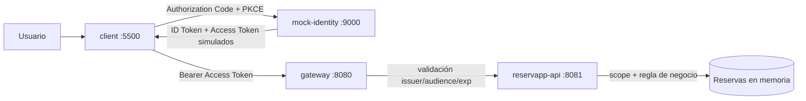

# Starter · ReservApp identidad

Este starter es una **aplicación ejecutable de laboratorio** para observar los conceptos de Semana 02 sin utilizar todavía Azure ni otro IDaaS real.

> **Importante:** `mock-identity` es un simulador didáctico. Sus tokens no son JWT reales y el código NO debe reutilizarse como seguridad de producción.

## Arquitectura



## Requisitos

- Java 21.
- Maven 3.9+.
- Navegador moderno.
- Para servir `client/`, cualquier servidor HTTP estático. Si ya tienes Python puedes usar `python -m http.server 5500`.

## 1. Levantar el IdP simulado

```bash
cd mock-identity
mvn spring-boot:run
```

Debe iniciar en `http://localhost:9000`.

## 2. Levantar ReservApp API

En otra terminal:

```bash
cd reservapp-api
mvn spring-boot:run
```

Debe iniciar en `http://localhost:8081`.

## 3. Levantar el Gateway

En otra terminal:

```bash
cd gateway
mvn spring-boot:run
```

Debe iniciar en `http://localhost:8080`.

## 4. Servir el cliente

En otra terminal:

```bash
cd client
python -m http.server 5500
```

Luego abre:

```text
http://localhost:5500/index.html
```

La URL importa: el IdP simulado reconoce esa dirección como `redirect_uri` registrada.

## Componentes que debes reconocer

| Componente | Rol conceptual |
|---|---|
| `client` | OAuth/OIDC Client (`reservapp-web`) |
| `mock-identity` | Authorization Server / IdP / IDaaS simulado |
| `gateway` | política transversal y validación técnica |
| `reservapp-api` | Resource Server + autorización de negocio |

## Usuarios del simulador

- `Ana` → `sub=user-1000`, rol `customer`.
- `Bruno` → `sub=user-2000`, rol `customer`.
- `Operador` → `sub=user-9000`, rol `operator`.

Reservas disponibles:

- `R-101` pertenece a Ana.
- `R-202` pertenece a Bruno.
- `R-303` pertenece a Ana.

## Qué puedes provocar sin modificar código

1. **401 sin token:** pulsa `Quitar token` y llama la API.
2. **ID token usado incorrectamente:** pulsa `Usar ID token como access token` y llama la API.
3. **Audience incorrecta:** cambia `reservapp-api` por otro valor antes del login.
4. **Redirect URI no registrada:** cambia la URL del callback.
5. **Client ID desconocido:** cambia `reservapp-web`.
6. **403 por scope:** autentícate solo con `reservations.read` e intenta cancelar.
7. **403 por regla de negocio:** Ana con `reservations.write` intenta cancelar `R-202`.
8. **Operador autorizado:** el operador con los scopes adecuados puede operar reservas de terceros.

## Qué observar en el código

No es necesario programar el flujo desde cero. Abre los archivos y ubica dónde se expresa cada responsabilidad:

- `TokenController.java`: Client ID, redirect URI, PKCE, issuer y emisión didáctica de tokens.
- `DidacticTokenFilter.java`: access token, issuer, audience y expiración en el Gateway.
- `ReservationController.java`: scopes y regla de negocio `solo mis reservas`.
- `client/index.html`: cliente, PKCE, Authorization header y visualización de respuestas.

El objetivo es poder explicar el sistema **mientras está funcionando**.
